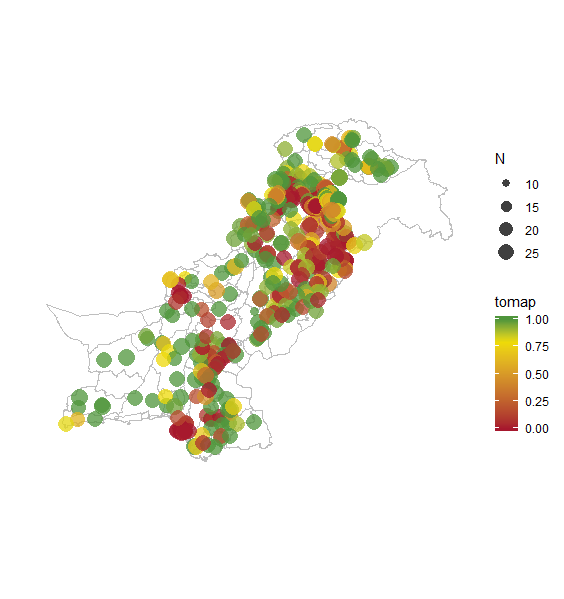

# Generic Code for running geostatistical models with INLA

Version 0.0.1

The current version of this script takes as input a subset of DHS data with GPS coordinates and produces a smoothed surface. Currently, there are no covariates or temporal elements, so the model is quite simply an intercept plus a smoothed random effect over distance (a GP with a matern covariance function). You can choose either a binomial or gaussian data likelihood. 

There are two scripts in this repo right now, `utils.R` is simply a set of helper functions. Start with `example_script.R`, which will walk you through the process from pulling in data to making a smooth map. The example script uses as an example the outcome of proportion of households using solid fuel from the 2017 Pakihstan DHS.

Note for IDM users, there is quite a bit of commenting in the example script, which should make it easy enough to adapt this example for other indicators you wish to spatially smooth.

Go from this:

To this:

Since we aren't using covariates, this is really just a way to smooth over data. You'll notice in areas with no data we regress to the mean quite quickly. 

Once you have the outputs, you can aggregate to any admin geography you wish. 

Happy mapping!